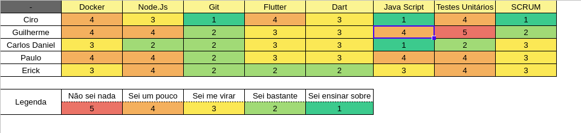

## Período
Duração: 27/04 à 04/05

## Monitoramento e Controle
### Presenças Sprint Plaining + Sprint Review
| Membros  |  Planning  |Review  |
| ------------------- | ------------------- |------------------- |
|  Ciro Costa |   ✔  |   ✔  |
|  Carlos Daniel |  ✔  |  ✔  |
|  Erick |  ✔  |  ✔  |
|  Paulo Vitor | ✔ |  ✔  |
|  Guilherme  | ✔ | X |

## Mapa do conhecimento  

## Status das Tarefas no Fim da Sprint
| **Issue** | **História** | **Resposáveis** | **Status** |
|--|--|--|--|
|**#146**| * | Erik | Done |
|**#147**| * | Carlos | Done |
|**#148**| * | Erick, Paulo | Done |
|**#149**| * | Erick, Paulo | Done | 
|**#150**| * | Ciro, Guilherme | Done | 
|**#151**| * | Ciro, Guilherme | Done  |    
|**#134**| * | Carlos | Done |
|**#136**| * | Ciro, Guilherme | Done |

- Pontos do planning: 21
- Pontos entregues: 31
- Dívida da sprint: Nenhuma

## Retrospectiva
#### Pontos positivos
- Consegui concluir todas as issues
- Melhorei e quase teriminei tudo
- 

#### Pontos negativos
- Percebi que devia ter implementado todas as funcionalidades de cada tela, e não só o que a issue pedia.
- Não consegui pegar uma issue extra
- 
- 

#### Dívidas técnicas
- Nenhuma

### Análise do Scrum Master
- Nessa sprint o time demonstrou um grande compromisso com o projeto e um grande amadurecimento, estou orgulhoso do time. Percebi pelo comentario das funcionalidades que como scrum master falhei em criar issues suficientemente detalhadas, irei detalhar melhor.