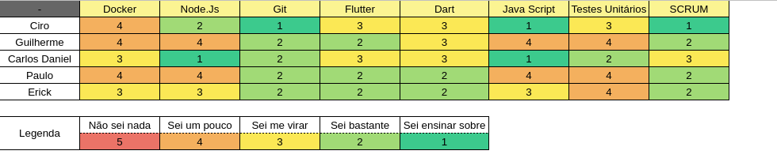

## Período
Duração: 04/05 à 11/05

## Monitoramento e Controle
### Presenças Sprint Plaining + Sprint Review
| Membros  |  Planning  |Review  |
| ------------------- | ------------------- |------------------- |
|  Ciro Costa |   ✔  |   ✔  |
|  Carlos Daniel |  ✔  |  ✔  |
|  Gabriel |  ✔  |  ✔  |
|  Erick |  ✔  |  ✔  |
|  Paulo Vitor | ✔ |  ✔  |
|  Guilherme  | X | ✔ |

## Mapa do conhecimento  

## Status das Tarefas no Fim da Sprint
| **Issue** | **História** | **Resposáveis** | **Status** |
|--|--|--|--|
|**#153**| * | Guilherme | Done |
|**#154**| * | Paulo, Erick | Done |
|**#155**| * | Paulo, Erick | Done |
|**#156**| * | Paulo, Erick | Done | 
|**#158**| * | Carlos | In progress | 
|**#159**| * | Ciro | Review  |    
|**#160**| * | Carlos | In progress |
|**#168**| * | Paulo, Erick | Done  |

- Pontos do planning: 36
- Pontos entregues: 25
- Dívida da sprint: #158, #159, #160

## Retrospectiva
#### Pontos positivos
- Consegui ser bem produtivo essa semana e entregar 4 issues
- Semestre está acabando

#### Pontos negativos
- Semestre está acabando

#### Dívidas técnicas
- Nenhuma

### Análise do Scrum Master
- Essa sprint foi a melhor