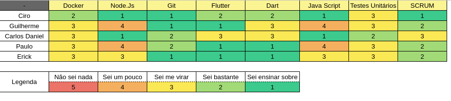

## Período
Duração: 13/04 à 20/04

## Monitoramento e Controle
### Presenças Sprint Plaining + Sprint Review
| Membros  |  Planning  |Review  |
| ------------------- | ------------------- |------------------- |
|  Ciro Costa |   ✔  |   ✔  |
|  Carlos Daniel |  ✔  |  ✔  |
|  Erick |  ✔  |  ✔  |
|  Paulo Vitor | ✔ |  ✔  |
|  Guilherme  | ✔ | ✔ |

## Mapa do conhecimento  

## Status das Tarefas no Fim da Sprint
| **Issue** | **História** | **Resposáveis** | **Status** |
|--|--|--|--|
|**#174**|  | Erick | Done |
|**#171**|  | Erick | Done |
|**#169**|  | Carlos | Done |
|**#167**|  | Paulo,Erick | Done | 
|**#166**|  | Ciro,Carlos | Done | 
|**#165**|  | Guilherme | Done |    
|**#159**|  | Ciro | Done |
|**#158**|  | Carlos | Done | 

- Pontos do planning: 31
- Pontos entregues: 39
- Dívida da sprint: Nenhuma

## Retrospectiva
#### Pontos positivos
- Última Sprint
- Fizemos Deploy
- Terminamos o MVP
- Deu certo

#### Pontos negativos
- Estou cansado e sem dinheiro
- Quase não deu tempo

#### Dívidas técnicas
- Nenhuma

### Análise do Scrum Master
- A equipe evoluiu muito tanto nas soft-skills, quanto nas hard-skills. Fiquei surpreso com a capacidade de cada um. E o deploy do back-end foi um sucesso :smile: