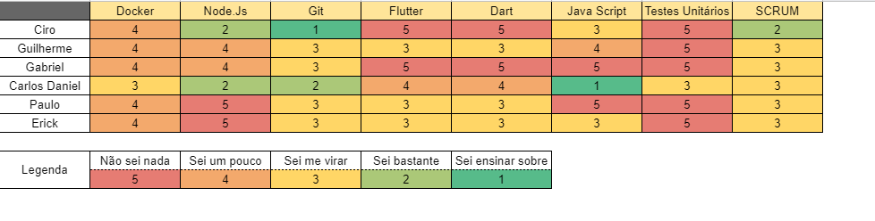

## Período
Duração: 16/03 à 23/03

## Monitoramento e Controle
### Presenças Sprint Plaining + Sprint Review
| Membros  |  Planning  |Review  |
| ------------------- | ------------------- |------------------- |
|  Ciro Costa |   ✔  |   ✔  |
|  Carlos Daniel |  ✔  |  ✔  |
|  Carlos Eduardo |  X  |  X  |
|  Gabriel |  X  |  ✔  |
|  Erick |  ✔  |  ✔  |
|  Paulo Vitor |  ✔  |  X  |
|  Guilherme  | ✔ | ✔ |

## Mapa do conhecimento  

 

## Status das Tarefas no Fim da Sprint
| **Issue** | **História** | **Resposáveis** | **Status** |
|--|--|--|--|
|**#85**| * | Carlos Daniel, Guilherme | Done |
|**#86**| * | Paulo, Erick | Done |
|**#87**| * | Carlos Eduardo, Gabriel | Done | 
|**#88**| US01 | Carlos Daniel, Gabriel | Done |
|**#89**| US02 - US04 | Carlos Eduardo,Carlos Daniel | Done |
|**#90**| US05 | Guilherme, Erick |In Progress |
|**#91**| US06 - US08 | Ciro, Paulo | In Progress |
|**#92**| * |  Carlos Daniel, Guilherme | Done |

- Pontos do planning: 21 
- Pontos entregues: 15
- Dívida da sprint: **#90** **#91**

## Retrospectiva
#### Pontos positivos
- Aprender flutter
- Consegui me organizar melhor para fazer minhas tarefas
- Aprender como funciona a producao de um software
- Começamos a colocar a mão na massa
- Aprendi a criar controladores melhores
- Consegui terminar as minhas issues em tempo

#### Pontos negativos
- Muita dificuldade em conseguir me organizar
- Um membro saiu do projeto
- Muitas atribuções da faculdade
- Pouco trabalho em equipe

#### Dívidas técnicas
- **#90**
- **#91**

### Análise do Scrum Master
- Foi uma semana conturbada. O membro Carlos Eduardo saiu do grupo, por motivos pessoais, esse acontecimento junto com a semana ter sido muito dificil acarretou em dívidas técnicas. Foi decidido que o cargo DevOps seria dividido entre Ciro e Carlos Daniel. Os membros do grupo parecem ter percebido a importância do SCRUM e tiveram uma maior comprometimento com ela essa Sprint.