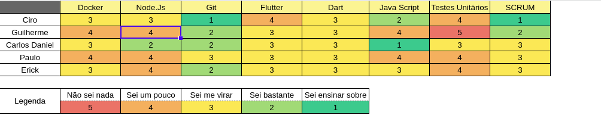

## Período
Duração: 06/04 à 13/04

## Monitoramento e Controle
### Presenças Sprint Plaining + Sprint Review
| Membros  |  Planning  |Review  |
| ------------------- | ------------------- |------------------- |
|  Ciro Costa |   ✔  |   ✔  |
|  Carlos Daniel |  ✔  |  ✔  |
|  Gabriel |  X  |  X  |
|  Erick |  ✔  |  ✔  |
|  Paulo Vitor | ✔ |  ✔  |
|  Guilherme  | ✔ | ✔ |

## Mapa do conhecimento  

## Status das Tarefas no Fim da Sprint
| **Issue** | **História** | **Resposáveis** | **Status** |
|--|--|--|--|
|**#124**| (US11 - US15) | Carlos, Erick | Done |
|**#125**| (US26-US29) | Ciro, Guilherme | Done |
|**#126**| * | Erick | Done |
|**#127**| * | Ciro, Gabriel | Done | 
|**#128**| * | Guilherme, Paulo | Done | 
|**#129**| * | Paulo, Carlos | Done  |    
|**#130**| * | Gabriel | Done |

- Pontos do planning: 
- Pontos entregues: 
- Dívida da sprint: Nenhuma

## Retrospectiva
#### Pontos positivos
- Acabei um issue.
- Comecei minhas issues bem cedo e consegui terminar todas

#### Pontos negativos
- Acabei ficando com uma issue que não sabia nada sobre e ficou como divida técnica
- Mais um membro retirou a matéria e saiu do grupo
- Não terminei outra issue

#### Dívidas técnicas
- Nenhuma

### Análise do Scrum Master
- 