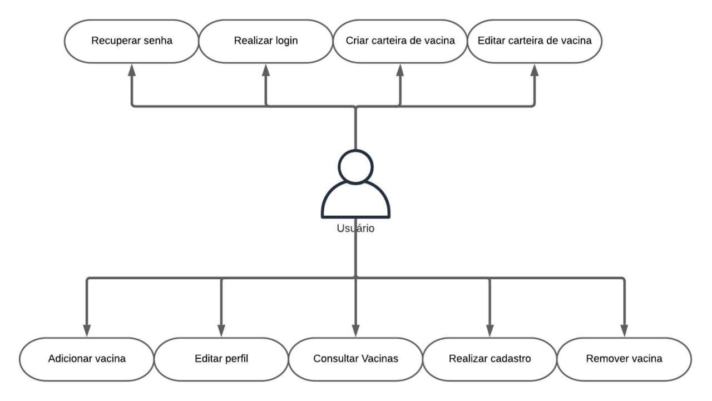

## Histórico de Versões
| Versão  |  Data  | Autor  |  Descrição  |
| ------------------- | ------------------- | ------------------- | ------------------- |
|  1.0 |  25/02/2020 | Carlos Daniel, Paulo Vitor |  Documento de visão |
|  1.1 |  26/02/2020 | Carlos Daniel, Paulo Vitor  |  Requisitos funcionais e não funcionais |
|  1.2 |  13/03/2021 | Carlos Daniel, Carlos Eduardo  | Casos de uso e diagrama de classes |

## Sumário
[**1. Introdução**](#_1-Introdução)
- [1.1. Propósito do Documento de Requisitos](#_11-Propósito-do-Documento-de-Requisitos)
- [1.2. Público Alvo](#_12-Público-Alvo)  

[**2. Descrição Geral do Produto - Metodologia 5W2H**](#_2-Descrição-Geral-do-Produto-Metodologia-5W2H)
- [2.1. Situação Atual](#_21-Situação-Atual)
- [2.2. Escopo](#_22-Escopo)
- [2.3. Atores](#_23-Atores)  

[**3.  Requisitos**](#_3-Requisitos)  

[**4. Casos de usos e Diagrama de Classes**](#_4-Casos-de-usos-e-Diagrama-de-Classes)  

## 1. Introdução

### 1.1  Propósito do Documento de Requisitos  

Este documento tem como propósito apresentar o aplicativo e-Vacina: uma carteira digital de vacinação. Além disso, também serão apresentados seus requisitos funcionais e não-funcionais e diagramas. Por fim, descrição do produto, interfaces e comportamentos esperados do sistema.

### 1.2  Público Alvo  
Este documento destina-se aos stakeholders (arquitetos de software, engenheiros de software, testadores e usuários classificados como usuários fornecedores).

## 2. Descrição Geral do Produto - Metodologia 5W2H

### O que é

O e-Vacina é um aplicativo mobile, disponível nas plataformas Android e IOS, que servirá como uma representação digital da carteira de vacinação usada pelos brasileiros, semelhante ao e-Título usado nas últimas eleições.
Nesse aplicativo, o usuário poderá fazer controle das doses das vacinas que tomou e acessar informações sobre datas de vacinação, doenças prevenidas e procedimentos.

### Para quem e onde

O aplicativo foi desenvolvido por estudantes da Universidade de Brasília para todos os brasileiros.

### Por quê

O e-Vacina é mais um passo para a transformação digital do mundo. Uma carteira de vacinação digital que trará integração e comodidade para o processo de imunização da população. 

### Quando utilizar

Inicialmente, o usuário deverá se registrar informando seus dados: nome, cidade, idade, gênero, etc. 
A partir das informações fornecidas, o aplicativo fornecerá as vacinas que devem ser tomadas, com suas respectivas datas e razões. Ao tomar a vacina, o usuário atualiza a sua carteira digital.
Periodicamente o usuário receberá notificações alertando sobre datas de vacinação. 

### Quanto custará

O aplicativo será gratuito.

### 2.1  Situação Atual

Atualmente, os brasileiro possuem a carteira de vacina física, que está sujeita a perdas, deterioração e rasuras, essa é a única forma oficial de fazer controle de vacinação individual. Algumas empresas como a Pfizer criaram aplicativos informativos sobre vacinas, porém esse não é direcionado ao público brasileiro. 

### 2.2  Escopo

| Num  |  Módulo  | Descrição |  
| ------------------- | ------------------- | ------------------- | 
|  1 |  Sistema mobile (responsivo) |O sistema deve funcionar conectado a uma API e banco de dados e ser acessível na Play Store. 

### 2.3 Atores
O sistema possui dois tipos de atores, sendo eles:     
   - Usuário Administrador (Desenvolvedores);      
   - Usuário Cliente (Cidadão);
 

| Num  |  Ator  | Definição e Privilégio de Acesso e Segurança |  
| ------------------- | ------------------- | ------------------- | 
|  1 |  Usuário Administrador | Responsável pelo gerenciamento do sistema, atualizando e adicionando novas vacinas à campanha de vacinação. |
|  2 |  Usuário Cliente | Interage com o sistema a partir do aplicativo, capaz de criar usuários-filhos e administrar as vacinas que cada um deve tomar.|

## 3. Requisitos

**3.1 Requisitos Funcionais**

|ID| Descrição| Prioridade|
| ------------------- | ------------------- | ------------------- |
|  RF 01  |  O sistema deve permitir ao usuário administrador cadastrar vacinas.|Essencial|
|  RF 02  |  O sistema deve permitir ao usuário administrador cadastrar campanhas de vacinas.|Essencial|
|  RF 03  |  O sistema deve permitir que o usuário administrador possa visualizar os dados de um usuário no banco, para que possa saber quem está cadastrado.|Essencial|
|  RF 04  |  O sistema deve permitir que o usuário administrador atualize os dados das vacinas.|Essencial|
|  RF 05  |  O sistema deve permitir que o usuário administrador delete vacinas. |Essencial|
|  RF 06  |  O sistema deve permitir ao usuário cadastrar vacinas que já foram aplicadas, informando a data.|Essencial|
|  RF 07  |  O sistema deve permitir que o usuário exclua vacinas do cartão de vacinas.|Essencial|
|  RF 08  |  O sistema deve permitir ao usuário visualizar informações sobre vacinas.|Essencial|
|  RF 09  |  O sistema deve notificar o usuário de campanhas de vacinação e vacinas pendentes e fazer agendamentos|Essencial|
|  RF 10  |  O sistema deve permitir uma interface diferenciada ao usuário administrador.|Essencial|
|  RF 11  |  O sistema deve permitir uma interface específica ao usuário cliente.|Essencial|
|  RF 12  |  O sistema deve permitir que o usuário realize um cadastro pessoal.|Essencial|
|  RF 13  |  O sistema deve permitir que o usuário realize o cadastro de mais de uma conta associada ao usuário.|Essencial|
|  RF 14  |  O sistema deve permitir que o usuário atualize seus dados.|Essencial|
|  RF 15  |  O sistema deve permitir que o usuário possa deletar uma conta associada ao usuário principal. |Essencial|
|  RF 16  |  O sistema deve permitir que o usuário possa deletar sua conta |Essencial|
|  RF 17  |  O sistema deve permitir que o usuário verifique o número de doses das vacinas tomadas.|Essencial|
|  RF 18  |  O sistema deve permitir que o usuário visualize as informações das vacinas tomadas. |Essencial|
|  RF 19  |  O sistema deve permitir que o usuário visualize as informações das vacinas. |Essencial|
|  RF 20  |  O sistema deve permitir que o usuário busque por vacinas no aplicativo, por parâmetros.|Essencial|
|  RF 21  |  O sistema deve permitir que o usuário imprima o cartão de vacina. |Essencial|
|  RF 22  |  O sistema deve permitir que o usuário mude entre as contas associadas ao usuário.|Essencial|
|  RF 23  |  O sistema deve notificar o usuário quando datas de vacinações se aproximarem. |Essencial|

**3.2 Requisitos Não Funcionais**

|ID| Descrição| Prioridade|
| ------------------- | ------------------- | ------------------- |
| RNF 01| Os dados dos usuários clientes serão gravados no sistema de banco de dados utilizando criptografia de dados.| Segurança |
| RNF 02| O sistema deve ser desenvolvido para mobile.| Interoperabilidade |
| RNF 03| O sistema deve dispor de design responsivo.| Usabilidade |
| RNF 04| O sistema deve utilizar o padrão UML 2.0 para a documentação.| Padrões |
| RNF 05| O sistema deve utilizar a linguagem de programação Javascript e Dart.| Portabilidade |
| RNF 06| A interface do sistema deve ser de fácil manipulação.| Usabilidade | 
| RNF 07| Os dados do usuário cliente serão trafegados no sistema de banco de dados utilizando criptografia de dados. | Segurança |

## 4. Casos de usos e Diagrama de Classes  

