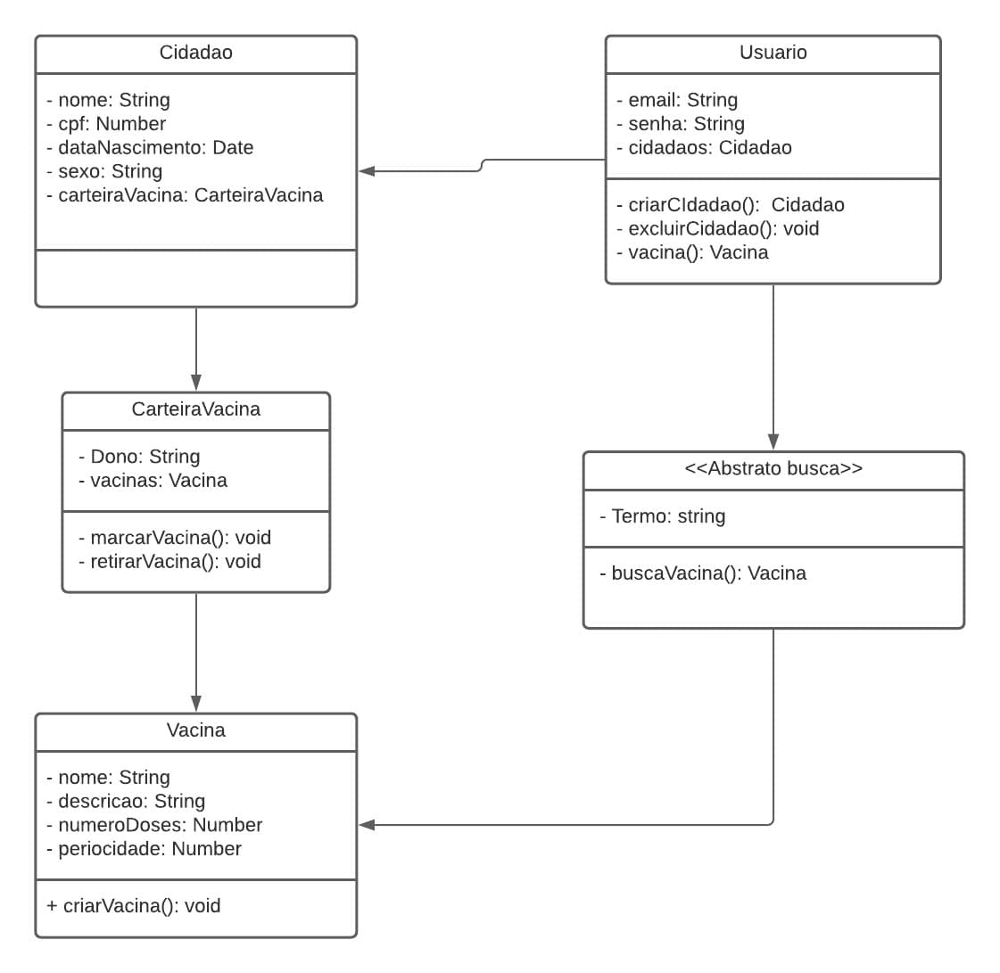

## Histórico de Versões
| Versão  |  Data  | Autor  |  Descrição  |
| ------------------- | ------------------- | ------------------- | ------------------- |
|  1.0 |  25/02/2020 | Carlos Daniel, Paulo Vitor |  Documento de visão |
|  1.1 |  26/02/2020 | Carlos Daniel, Paulo Vitor  |  Requisitos funcionais e não funcionais |
|  1.2 |  13/03/2021 | Carlos Daniel, Carlos Eduardo  | Casos de uso e diagrama de classes |

## Sumário
1.  **Introdução**
- 1.1. Propósito do Documento de Requisitos
- 1.2. Público Alvo
2.  **Descrição Geral do Produto**
- 2.1. Situação Atual
- 2.2. Escopo
- 2.3. Atores
3.  **Requisitos**
- 3.1. Funcionais
- 3.2. Não Funcionais

### 1.  Introdução

**1.1  Propósito do Documento de Requisitos**  
Este documento tem como propósito apresentar o aplicativo e-Vacina: uma carteira digital de vacinação. Além disso, também serão apresentados seus requisitos funcionais e não-funcionais e diagramas. Por fim, descriação do produto, interfaces e comportamentos esperados do sistema.

**1.2  Público Alvo**  
Este documento destina-se aos stackholders (arquitetos de software, engenheiros de software, testadores e usuários classificados como usuários fornecedores).

### 2. Descrição Geral do Produto - Metodologia 5W2H

**O que é**

O e-Vacina é um aplicativo mobile, disponível nas plataformas Android e IOS, que servirá como uma representação digital da carteira de vacinação usado pelos brasileiros, semelhante ao e-Título usado nas últimas eleições.
Nesse aplicativo, o usúario poderá fazer controle das doses das vacinas que ele tomou e acessar informações sobre datas de vacinação, doenças previnidas e procedimentos.

**Para quem e onde**

O aplicativo foi desenvolvido por estudantes da Universiade de Brasília para todos os brasileiros.

**Por quê**

O e-Vacina é mais um passo para transformação digital do mundo. Uma carteira de vacinação digital que trará integração e comodidade para o processo de imunização da população. 

**Quando utilizar**

O aplicativo será usado periodicamente em períodos de vacinção.

**Como será utilizada**

Inicialmente, o usuário deverá se registrar informando seus dados: nome, cidade, idade, gênero, ect. 
A partir das informações fornecidas, o aplicativo fornecerá as vacinas que devem ser tomadas, com suas respectivas datas e razões. Ao tomar a vacina, o usuário atualiza a sua carteira digital.
Periodicamente o usuário receberá notificações alertando sobre datas de vacinação. 

**Quanto custará**

O aplicativo será gratuito.

**2.1  Situação Atual**

Atualmente, os brasileiro possuem a carteira de vacina física, que está sujeita a perdas, deterioração e rasuras, essa é a única forma oficial de fazer controle de vacinação individual. Algumas empresas como a Pfizer criaram aplicativos informativos sobre vacinas, porém esse não é direcionado ao público brasileiro. 

**2.2  Escopo**

| Num  |  Módulo  | Descrição |  
| ------------------- | ------------------- | ------------------- | 
|  1 |  Sistema mobile (responsivo) |O sistema deve funcionar conectado a uma API e banco de dados e ser acessível na Play Store. 

**2.3 Atores** 
O sistema possui dois tipos de atores, sendo eles:     
   - Usuário Administrador (Desenvolvedores);      
   - Usuário Cliente (Cidadão);
 

| Num  |  Ator  | Definição e Privilégio de Acesso e Segurança |  
| ------------------- | ------------------- | ------------------- | 
|  1 |  Usuário Administrador | Responsável pelo gerenciamento do sistema, atualizando e adicionando novas vacinas a campanha de vacinação. |
|  2 |  Usuário Cliente | Interage com o sistema a partir do aplicativo, capaz de criar usuários-filhos e administrar as vacinas que cada um deve tomar.|

### 3. Requisitos

Os requisitos foram levantados usando a metodologia MoSCoW (Must, Should, Could, Would).

|ID|Descrição|Prioridade|
|--|--|--|
|US01| Criar um usuário na plataforma com os dados: email, telefone e senha.|must|
|US02| Visualizar os dados de um usuário no banco, para que eu possa saber quem está cadastrado.|must| 
|US03| Rota para os usuários atualizarem seus dados.|must|
|US04| Rota para deletar usuários|must|
|US05| Cadastrar no e-Vacina para fazer o controle de vacinação e dos dependentes.|must|
|US06| Visualizar os dados no e-Vacina.|must| 
|US07| Atualizar meu dados de acordo com as necessidades.|must| 
|US08| Deletar os meus dados do banco, caso não se queira usar mais o aplicativo.|must|
|US09| Criar uma conta na plataforma com os dados: Nome, cpf, Sexo, data de nascimento.|must|
|US10| Visualizar os dados de uma conta no banco, para que se possa saber quem está cadastrado.|must| 
|US11| Rota para os usuários atualizarem os dados das contas.|must|
|US12| Criar uma rota para deletar contas.|must|
|US13| Cadastrar uma conta no e-Vacina |must|
|US14| Visualizar os dados de uma conta no e-Vacina.|must| 
|US15| Atualizar os dados de uma conta de acordo com necessidades.|must| 
|US16| Deletar os dados de uma conta do banco, caso eu não queira usar mais aquela conta.|must|
|US19| Cadastrar vacinas no banco com os campos: nome, doencas_previnidas, contra_indicacoes, idade, doses, periocidade.|Must|
|US20| Atualizar os dados das vacinas caso seja necessário.|Must|
|US21| Deletar vacinas do banco caso seja necessário.|Must|
|US22| Listar as vacinas do banco de dados caso seja necessário.|must|
|US23| Verificar o número de doses das vacinas tomadas.|Must|
|US24| Atualizar o número de doses tomadas de uma vacina.|Must|
|US25| Visualizar as informações das vacinas tomadas.|Must|
|US26| Visualizar as informações das vacinas.|Must|
|US27| Rota para adicionar vacinas à carteira de vacinação.|must|
|US28| Rota para excluir vacinas do cartão de vacinas.|must|
|US29| Adicionar vacinas à carteira de vacina.|must|
|US30| Visualizar as vacinas da carteira de vacina.|must|
|US31| Excluir vacinas da carteira de vacina.|must|
|US39| O sistema deve ser desenvolvido para mobile.|must|
|US32| Os dados dos usuários clientes serão gravados no sistema de banco de dados utilizando criptografia de dados.|should|
|US33| Associar as carteiras de vacinas a suas contas.|should|
|US34| O sistema deve dispor de design responsivo.|should|
|US35| Os dados do usuário cliente serão trafegados no sistema de banco de dados utilizando criptografia de dados. |should|
|US36| O sistema deve utilizar o padrão UML 2.0 para a documentação.|could|
|US37| O sistema deve utilizar a linguagem de programação Javascript e Dart.|could|
|US38| A interface do sistema deve ser de fácil manipulação.|could| 
|US39| Os dados do usuário cliente serão trafegados no sistema de banco de dados utilizando criptografia de dados. |could|
|US40| Ter mais de uma conta associada ao usuário.|could|
|US41| Mudar de contas associadas ao usuário.|could|
|US42| Imprimir  cartão de vacina.|woud|
|US43| Rota para buscar vacinas de acordo os parâmetros de pesquisa.|would| 
|US44| Buscar por vacinas no aplicativo, por parâmetros.|would|
|US45| Notificar quando datas de vacinações se aproximarem.|would|
|US46| Aplicativo no modo escuro.|would|

### 4. Casos de usos e Diagrama de Classes

